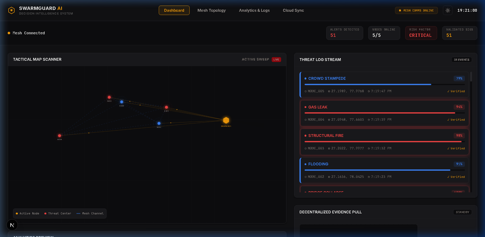
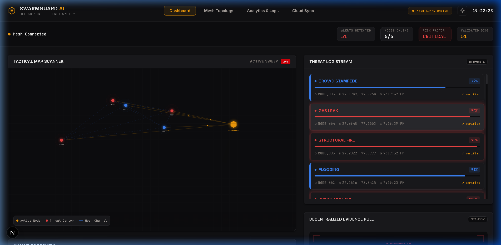
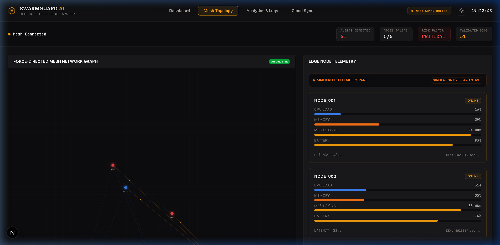
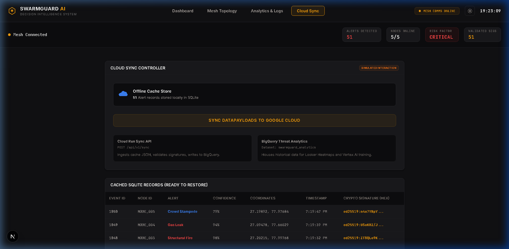
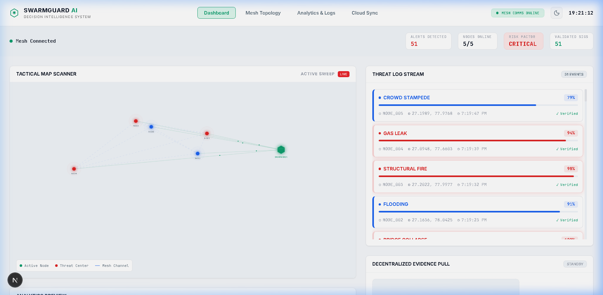

<p align="center">
  
  
  
  
  
  
</p>

# 🛡️ SwarmGuard AI

**Offline-first edge intelligence for disaster response.**

Simulated IoT edge nodes run local threat inference, cryptographically sign payloads with **Ed25519**, and propagate alerts through a **WebSocket mesh relay** to a decoupled real-time **Swarm Box** dashboard — all without requiring internet connectivity.

---

## 🎯 What It Does

```
┌─────────────┐     ┌──────────────┐     ┌──────────────┐     ┌─────────────────┐
│  Edge Node  │────▶│  Mesh Relay  │────▶│  Backend API │────▶│   Dashboard     │
│  (Sensor)   │     │  (WebSocket) │     │  (FastAPI)   │     │   (Next.js)     │
│             │     │              │     │              │     │                 │
│ • Detect    │     │ • Receive    │     │ • Verify     │     │ • Live Alerts   │
│ • Sign      │     │ • Broadcast  │     │   Ed25519    │     │ • Tactical Map  │
│   (Ed25519) │     │   to peers   │     │ • Cache in   │     │ • Analytics     │
│ • Transmit  │     │              │     │   SQLite     │     │ • TTS Audio     │
│             │     │              │     │ • Push via   │     │ • Evidence View │
│             │     │              │     │   WebSocket  │     │                 │
└─────────────┘     └──────────────┘     └──────────────┘     └─────────────────┘
```

### Threat Scenarios (Simulated)

| Node | Threat Type | Confidence | Location |
|:---|:---|:---:|:---|
| `NODE_001` | 🌉 Bridge Collapse | 98% | Agra Region |
| `NODE_002` | 🌊 Flooding | 87% | Agra Region |
| `NODE_003` | 🔥 Structural Fire | 94% | Agra Region |
| `NODE_004` | 💨 Gas Leak | 91% | Agra Region |
| `NODE_005` | 🏃 Crowd Stampede | 82% | Agra Region |

---

## 🖼️ Interface Showcase

Here is a preview of the SwarmGuard AI Command Center dashboard, featuring the premium warm SaaS theme (charcoal background `#111113`, warm amber accents, and clean severity-based overlays).

### 1. Main Dashboard (Dark Mode)
The main command view displays real-time threat metrics, the active threat feed, live telemetry logs, and the tactical radar-sweep map.


### 2. Evidence Viewer & Threat Log
Selecting a threat alert from the stream loads its cryptographic payload, validation status, and edge node signature metadata onto the decentralized Evidence Viewer canvas.


### 3. Mesh Topology & Cloud Sync
Dedicated tabs mapping peer-to-peer relay links and managing background cloud database synchronization.
<table>
  <tr>
    <td width="50%"><b>Mesh Network Topology</b></td>
    <td width="50%"><b>Cloud Sync Console</b></td>
  </tr>
  <tr>
    <td></td>
    <td></td>
  </tr>
</table>

### 4. Main Dashboard (Light Mode)
A clean, high-contrast light mode is supported and selectable at any time via the theme toggle in the top-right header.


---

## 📁 Repository Structure

```
APAC-C-2/
├── .github/workflows/ci.yml      # CI — pytest + Next.js build on every push
│
├── apps/
│   ├── api/                       # FastAPI backend (pure JSON/WebSocket API)
│   │   ├── app/
│   │   │   ├── main.py            # App factory, lifespan, CORS, middleware
│   │   │   ├── core/              # Settings (Pydantic), logging, error handlers
│   │   │   ├── routers/           # /api/v1/alerts, /healthz, /ws/dashboard
│   │   │   ├── schemas/           # Pydantic request/response models
│   │   │   ├── services/          # Key registry, mesh listener, SQLite cache, TTS
│   │   │   └── generate_keys.py   # Export edge node public keys to node_keys.json
│   │   ├── tests/                 # pytest suite (key registry + crypto verification)
│   │   ├── Dockerfile             # Production container build
│   │   └── requirements.txt       # Python dependencies
│   │
│   └── web/                       # Next.js 15 dashboard (TypeScript + Tailwind)
│       └── src/
│           ├── app/               # Pages: Dashboard, Analytics, Mesh, Cloud Sync
│           ├── components/        # AlertFeed, TacticalMap, EvidenceViewer, Charts
│           └── context/           # AlertsContext (WebSocket + auto-reconnect)
│
├── services/
│   ├── edge_nodes/                # Simulated IoT nodes (Ed25519 signing + scenarios)
│   ├── mesh_network/              # WebSocket relay hub (broadcast to all peers)
│   └── cloud_layer/               # Stubbed cloud sync API (future BigQuery/Pub-Sub)
│
├── scripts/
│   └── run_decoupled_demo.py      # One-command launcher for the full pipeline
│
├── docs/                          # Architecture audit, migration plan, handover state
├── docker-compose.yml             # Orchestrates mesh-relay + api-backend containers
└── README.md
```

---

## 🚀 Quick Start

### Prerequisites

- **Python 3.11+** with `pip`
- **Node.js 20+** with `npm`

### 1. Install Backend Dependencies

```bash
pip install -r apps/api/requirements.txt
```

### 2. Install Frontend Dependencies

```bash
cd apps/web && npm install && cd ../..
```

### 3. Launch Everything

```bash
python scripts/run_decoupled_demo.py
```

This single command starts:
1. **Mesh Relay** on `ws://localhost:8765`
2. **FastAPI Backend** on `http://localhost:8010`
3. **Next.js Dashboard** on `http://localhost:3000`
4. **5 Edge Nodes** (staggered at 5–35s intervals)

### 4. Open the Dashboard

| Service | URL |
|:---|:---|
| 🖥️ Dashboard | [http://localhost:3000](http://localhost:3000) |
| 📡 API Docs | [http://localhost:8010/docs](http://localhost:8010/docs) |
| ❤️ Health Check | [http://localhost:8010/healthz](http://localhost:8010/healthz) |

---

## 🔐 Security Features

| Feature | Implementation |
|:---|:---|
| **Payload Signing** | Ed25519 keypairs per node; payloads signed before transmission |
| **Signature Verification** | Backend verifies every payload against pre-shared public keys |
| **Tamper Rejection** | Modified payloads and unknown node IDs are rejected |
| **Relay Auth** | Optional `RELAY_AUTH_TOKEN` — token passed via WS query string |
| **API Key Auth** | Optional `X-SwarmGuard-Key` header — off by default in dev |
| **CORS** | Restricted to configured `CORS_ALLOWED_ORIGINS` only |

---

## ⚙️ Environment Variables

### Backend (`apps/api/.env`)

| Variable | Default | Purpose |
|:---|:---|:---|
| `API_HOST` | `0.0.0.0` | FastAPI bind host |
| `API_PORT` | `8010` | FastAPI bind port |
| `MESH_RELAY_URL` | `ws://localhost:8765` | Mesh relay WebSocket URL |
| `SQLITE_PATH` | `./swarm_cache.db` | SQLite database file path |
| `NODE_KEYS_PATH` | `./node_keys.json` | Public key registry file path |
| `CORS_ALLOWED_ORIGINS` | `http://localhost:3000` | Comma-separated CORS origins |
| `SWARMBOX_API_KEY` | *(unset)* | API key for `X-SwarmGuard-Key` header |
| `LOG_LEVEL` | `INFO` | Logging verbosity |
| `SENTRY_DSN` | *(unset)* | Backend Sentry error monitoring |

### Frontend (`apps/web/.env.local`)

| Variable | Default | Purpose |
|:---|:---|:---|
| `NEXT_PUBLIC_API_BASE_URL` | `http://localhost:8010/api/v1` | REST API base URL |
| `NEXT_PUBLIC_WS_URL` | `ws://localhost:8010/ws/dashboard` | WebSocket endpoint |
| `NEXT_PUBLIC_SENTRY_DSN` | *(unset)* | Frontend Sentry hook |

### Mesh Relay (environment or Docker)

| Variable | Default | Purpose |
|:---|:---|:---|
| `RELAY_HOST` | `0.0.0.0` | Relay bind host |
| `RELAY_PORT` | `8765` | Relay bind port |
| `RELAY_AUTH_TOKEN` | *(unset)* | Optional connection token |

---

## 🐳 Docker Compose

Run the backend stack (mesh relay + API) in containers:

```bash
docker compose up --build
```

> The frontend (`apps/web`) runs separately via `npm run dev` or can be deployed to Vercel.

---

## 🧪 Testing

### Backend Tests

```bash
pytest apps/api/tests/ -v
```

### Frontend Build Verification

```bash
cd apps/web && npm run build
```

### CI Pipeline

GitHub Actions runs both on every push to `main`:
- **Backend job:** Python 3.11 → `pip install` → `pytest`
- **Frontend job:** Node 20 → `npm ci` → `eslint` → `next build`

---

## 🚢 Deployment

Both apps are fully decoupled and designed for independent PaaS deployment:

### Backend → Render / Fly.io / Cloud Run

1. Build from `apps/api/Dockerfile`
2. Expose port `8010`
3. Set `MESH_RELAY_URL`, `CORS_ALLOWED_ORIGINS`, and optionally `SWARMBOX_API_KEY`

### Frontend → Vercel / Netlify

1. Set root directory to `apps/web`
2. Configure `NEXT_PUBLIC_API_BASE_URL` and `NEXT_PUBLIC_WS_URL` to point to your deployed backend
3. Deploy with standard Next.js build presets

---

## 📊 Tech Stack

| Layer | Technology |
|:---|:---|
| **Edge Nodes** | Python, Ed25519 (`cryptography` library) |
| **Mesh Network** | Python `websockets` |
| **Backend API** | FastAPI, Uvicorn, Pydantic, SQLite |
| **Frontend** | Next.js 15, TypeScript, Tailwind CSS, Chart.js |
| **TTS** | Template NLG (backend) + Web Speech API (browser) |
| **CI/CD** | GitHub Actions |
| **Containers** | Docker, Docker Compose |
| **Monitoring** | Sentry (optional) |

---

## 📄 Documentation

Detailed architecture documents are in the [`docs/`](docs/) folder:

- **`ARCHITECTURE_AUDIT.md`** — Full codebase audit of the original monolith
- **`ARCHITECTURE_PLAN.md`** — Target architecture, API contract, and migration phases
- **`HANDOVER_STATE.md`** — Ground-truth status of every component

---

<p align="center">
  <sub>Built for the APAC Hackathon 2026 — Team SwarmGuard</sub>
</p>
